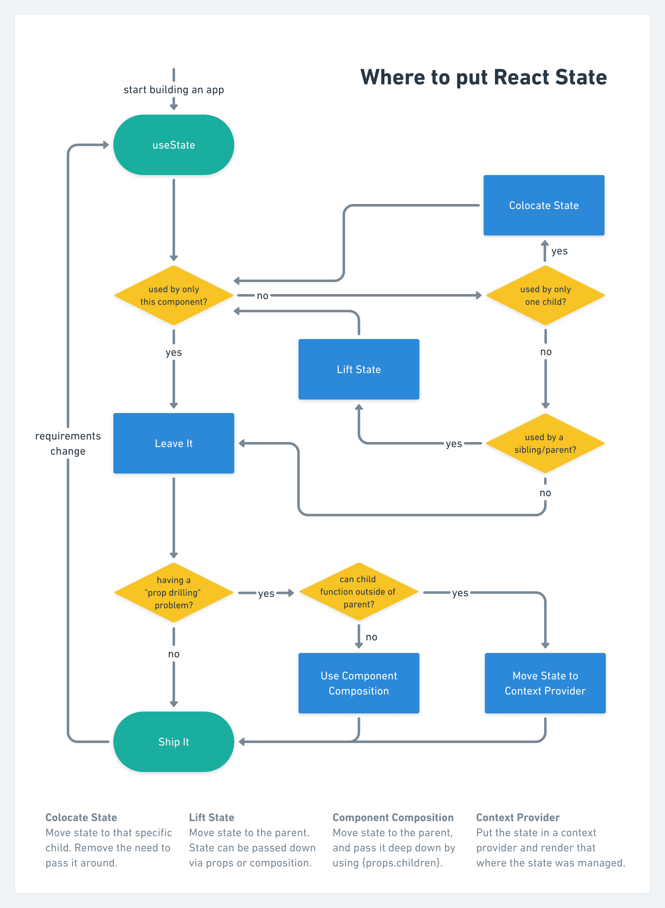

# React Resources - A list 📝 of Learning Material 📚

## React Hooks

### [useState](https://beta.reactjs.org/learn/state-a-components-memory#anatomy-of-usestate)

When we want our component to store some value we use `useState` hook. This value is maintained between re-renders. 

**Syntax**

```js
function App() {
  const [name, setName] = React.useState("vikas");
}
```

`useState` hook return a `pair` of value in an array.

- Frist value in array is the `value` you ask react to store
- Second value in array is a `setter function` which will update the stored value and ask React to re-render the component.

#### [Lazy initialization](https://beta.reactjs.org/reference/usestate#passing-an-initializer-function-to-usestate)

  When using `useState` always remember that the initial value that we pass to `useState` will be used only once when React mounts the component for the first time. After that it will be ignored. But if the value you are passing to the `useState` is returned from the result of a epensive calculation or it is a `IO` operation like reading from `localStorage` or `sessionStorage`, do not pass it directly to `useState` like this

```js
function App() {
  const [name, setName] = React.useState(localStorage.getItem("name") || "");
}
```

With above code in place whenerver there is a re-render `localStorage.getItem('name')` will be run. This `localStorage.getItem('name')` will call read from the localStorage although as mentioned above the React will ignore this value on re-renders as React is already maintaining the state value.

At first this will look ok because we think that is what we want because the complete functionality might be

- Read from localstorage and if the value is not there then set empty string `''`
- Also whenever the name changes set it to `localStorage`

So reading from localStorage on each render will look fine initially but remeber once we provide initial state to `React`, it will take care of syncing the state and ignore the value from expensive calculation on re-renders. So reading on every re-render from localStorage is not required. What we actually want is that,

When the app load for the first time read from the localStorage and then keep this state value synced with change in value of state.

So to achieve this we will need to lazy initialise the value. We can do this by passing a function to `useState`. Yes!! we can pass a function to `useState` as well.

```js
function App() {
  const [name, setName] = React.useState(
    () => localStorage.getItem("name") || ""
  );
}
```

Just by doing this we simply tell `React`:

> We want you to run this function on first load and then never run it again

If you see the React Hook Flow [diagram](https://github.com/donavon/hook-flow) by [Donavan](https://twitter.com/donavon) it will be more clear.


As per the diagram, `Lazy Initialization` happen only once in life cycle of component.

Read more about it in Kent C. Dodds [blog](https://kentcdodds.com/blog/use-state-lazy-initialization-and-function-updates).


## useEffect

Whenever we want to create some side effect we will use `useEffect` to do it. 

Side effect can be anything like calling an api or reacting to some changes on state value.

We want to create side effect in various scenarios, like: 

* Everytime our app or component is rendering
* When certain state value is update via `setState` 
* Only when our app or component is `mounted` and `unmounted`

`useEffect` syntax changes for each of these scenarios. A generic sytanx might be like this : 


```js

  useEffect(() => {
    // `effect` that we want to fire goes here 
    return () => {
      // any `cleanup` that we want do goes here
    }
  }, 
  [input] // Any dependency for which we want to fire sideeffect goes here aka dependecy array
  )

```

Let's talk about `useEffect` syntax scenario wise: 


### Everytime our app or component is rendering

If we want to run our side effect for each render then we simply remove the `dependency array`: 

```js 

 useEffect(() => {
    // `effect` that we want to fire goes here 
  })
  
```

### Only when our app or component is `mounted`

If we provide a blank array as dependecy to `useEffect` then it will only run when component is mounted. 


```js

  useEffect(() => {
    // `effect` that we want to fire goes here 
    return () => {
      // any `cleanup` that we want do goes here
    }
  }, 
  [] // An empty depedency array
  )

```

### When certain state value is update via `setState`

If we provide a value or set of values to dependecy array the `useEffect` will run every time one of the values in dependency array changes. 


```js

  useEffect(() => {
    // `effect` that we want to fire goes here 
    return () => {
      // any `cleanup` that we want do goes here
    }
  }, 
  [] // An empty depedency array
  )

```

Before firing the Effect in `Update` phase `React` will first run a `clean up` function. You can define this clean up fuctionality as return function of the first argument to `useEffect`. Whatever is the part of the return funtion will be run on  cleanup phase in `Update` and `Unmount` phase. 

If you have attached some event listners as a part of effect and you want to remove the event listener when component unmounts then you can define it in the clean up function.

```js

  useEffect(() => {
    // `effect`
    
    return () => {
    // CLEAN UP FUNCTIONALITY
    }
    
  }, 
  [] // your dependencies
  )

```


## Where to put state decision tree


This image is taken from Kent C Dodds' blog [State Colocation will make your React app faster](https://kentcdodds.com/blog/state-colocation-will-make-your-react-app-faster). Refer to blog for better understanding this flow




